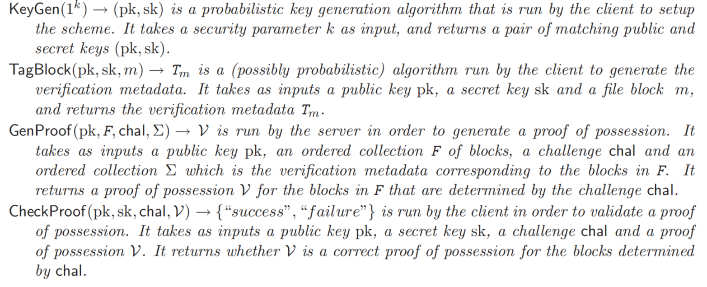

Ateniese等人《provable data possession at untrusted stores》

2007年，Ateniese等人最先对数据持有性证明方案进行了形式化建模，提出了对数据文件进行分块的思想，降低了标签生成的代价，并利用同态认证标签将多个数据的标签聚合成一个值，有效减少了计算和通信开销。验证时，采用随机取样的方法对云中数据进行完整性验证，通过对部分数据的检测来推测整个数据的完整性。

## 储备知识

客户端 $C$ 想要将一个文件 $F$ 存储在服务器 $S$ 中，文件 $F$ 被分为 $n$ 块，$F=(m_1, m_2, ... m_n)$

**同态认证标签$HVT_s$**

给定一个消息 $m$ (关联一个文件块)，我们用 $T_m$ 表示它的同态认证标签。标签会和文件 $F$ 一起被存储在云服务器中。同态认证标签作为文件块的验证元数据，除了不可伪造性，它们还具有以下的性质：

- 无块验证 (Blockless verification): 使用$HVTs$，服务器可以在客户端没有保存文件快的情况下，构造一个证明来让客户端验证服务器是否正确持有文件块。
- 同态标签(Homomorphic tags): 给定两个值$T_{m_i}$和$T_{m_j}$，任何人可以根据对应消息的和$m_i+m_j$把他们组合成一个值$T_{m_i+m_j}$。

在本文的构造中，一个$HVT$是一对值 $(T_{i,m},W_i)$，这里的$W_i$是一个由索引 $i$ 获得的随机值，$T_{i,m}$存储在服务器中。索引 i 可以看作是一个一次性索引，因为在接下来的标签计算中不会重用它（一个简单的确保每个标签使用的索引 $ i$不同的方法是使用一个全局的计数器）。随机值 $W_i $是通过将索引 $i$ 链接到一个秘密值来生成的，这确保了每一次计算标签是， $W_i $是不同的且不可预测的

**强调：**基于聚合签名，多重签名，批量RSA，RSA批量验证，等方法都不能实现无块验证，这是PDP方案需要的。实际上，客户端必须有能力验证特定文件块上的标签，即使他不拥有任何这些块。

## 定义

一个PDP方案由四个多项式时间算法$(KeyGen, TagBlock, GenProof, CheckProof) $组成：

一个PDP系统可以由一个PDP方案构造得出，分为两个阶段，**Setup**和**Challenge**：

**Setup: **拥有文件F的客户端 $C$ 运行 $KeyGen(1^k)$ 算法获得公私钥对 $(pk,sk)$，然后对每一个文件块$m_i(1\leq m_i \leq n)$，执行 $TagGen(pk,sk,m_i)$生成 $T_{m_i}$。$C$ 存储公私钥对 $(pk.sk)$，将 $pk, F, \sum=(T_{m_1},...,T{m_n})$ 发送给服务器 $S$ 存储，并从本地存储删除 $F$ 和 $\sum$ 。

**Challenge:** $C$ 生成一个挑战 $chal$，表明 $C$ 想要得到持有性证据的特定数据块。$C$ 发送 $chal$ 给 $S$ 。$S$ 运行 $GenProof(pk,F,chal,\sum)$ 生成数据持有性证据 $V$ 并发送给 $S$。最后，$C$ 可以通过运行$CheckProof(pk, sk, chal, V)$检查证据 $V$ 的有效性。

在Setup阶段，C 计算每个文件快的标签并把它们和文件 F 一起存储在 S 上。在Challenge 阶段，C 要求

