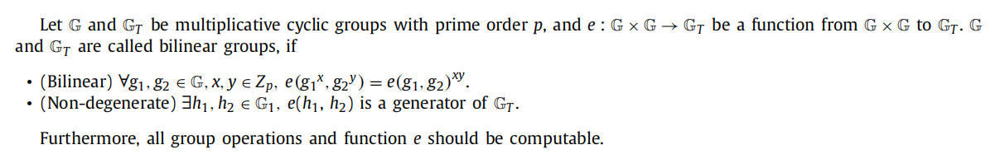
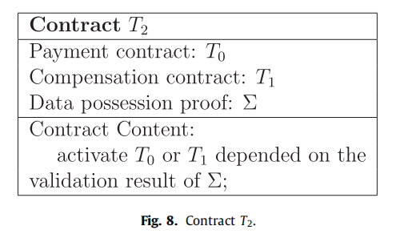
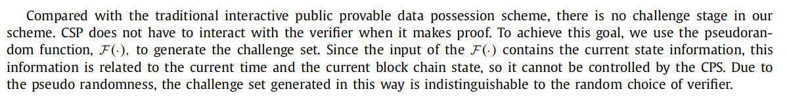
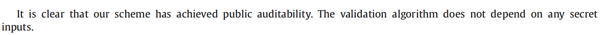

# Blockchain-based fair payment smart contract for public cloud storage auditing

## 摘要

​	云存储在当今的云生态系统中扮演着重要的角色。越来越多的客户倾向于将数据外包给云端。尽管它具有丰富的优势，完整性一直是一个重要的问题。审计方法通常用于确保云场景中的完整性。然而，传统的审计方案需要一个第三方审计者（TPA），而这在现实世界中并不总是可行的。此外，先前的方案意味着有限的现收现付服务，因为它要求客户提前支付服务费用。

​	在本文中，我们旨在通过采用区块链替代TPA，并设计一个基于区块链的公共云存储审计公平支付智能合约来解决上述缺点。在我们的系统中，数据所有者和云服务提供商（CSP）将运行一个基于区块链的智能合约。该合约确保CSP需要定期提交**数据占有证明**。只有验证通过，CSP才会得到报酬；否则，它不会得到报酬，但必须支付罚款。为了减少合约执行过程中的交互数量，我们提出了**非交互式公共可证明数据占有**的概念，并在此基础上设计了一个基于区块链的公共云存储审计智能合约。

---

## 1 Our Contribution

​	利用区块链的去中心化和自动触发的优势，我们设计了一个基于区块链的公共云存储审计公平支付智能合约。在我们的系统中，数据所有者和CSP将运行一个基于区块链的智能合约。该合约确保CSP需要定期提交数据占有证明。只有当验证通过后，CSP才会被支付，否则CSP不仅不会获得任何报酬，还要支付罚款。

​	当使用传统的公共审计协议时，验证者需要与CSP进行交互。在这个过程中，验证者通常生成一个随机的挑战，CSP基于这个挑战返回一个数据占有证明。这种交互式证明不适合在智能合约平台上执行，因为每个共识节点（作为验证者）都需要与CSP交互，系统通信的复杂度和CSP的计算成本将是不可接受的。为了避免智能合约平台与CSP在合约执行过程中的交互，我们提出了非交互式公共可证明数据占有（NI-PPDP）的概念，并在此基础上设计了一个基于区块链的云存储公平支付智能合约。具体地说，我们通过扩展Wang等人的交互式公共审计方案[33]，构造了一个有效的NI-PPDP方案。具体来说，本文的贡献主要包括以下三个方面：

- 提出了非交互式公共可证明数据占有（NI-PPDP）的概念；
- 构造了一个有效的NI-PPDP格式，并在随机喻言模型中给出了形式化证明；
- 基于NI-PPDP设计一种基于区块链的云存储公平支付智能合约

---

## 2 Preliminaries

### 2.1 Bilinear parings

### 2.2 Computational Diffiffiffie-Hellman (CDH) assumption

### 2.3 Review Wang et al’s interactive public auditing scheme

---

## 3. Non-Interactive public provable data possession scheme

### 3.1 System Model

​	在非交互式公共可证明数据占有（NI-PPDP）方案中，有三种类型的实体，即数据所有者、CSP和验证者（如图3所示）。与传统的交互式公共可证明数据占有方案不同，CSP和验证者在审计过程中不需要交互。一个NI-PPDP方案由4种算法组成，这些算法分为两个阶段：

### 3.2 Threat model

- 我们假设CSP没有向外部各方透露其托管数据的动机，也没有放弃其托管数据的动机。但是，由于一些无法控制的因素，如软件漏洞、硬件故障、网络路径中的漏洞、有经济动机的黑客、恶意或意外的管理错误，用户数据的完整性可能会被破坏。此外，为了其自身的利益，CSP甚至可能决定向数据所有者隐藏此数据损坏事件。
- 验证者可以根据CSP提供的证明，为数据所有者验证数据的完整性。但是，如果验证者能够从证明中了解到外包数据的相关信息，则可能会损害数据所有者。
- 我们假设CSP不会与任何验证者串通。

### 3.3 Design goals

### 3.4. Formal security defifinition

在上述设计目标中，数据完整性和隐私保护是NI-PPDP关键的安全特性。因此，我们给出的正式定义如下。

#### *3.4.1 Data integrity (soundness)*

#### 3.4.2. Privacy preserving

---

## 4. Blockchain-based fair payment smart contract for cloud storage

​	在传统的云存储系统中，数据所有者在使用云存储之前必须支付租金。一旦数据被云存储服务提供商丢失或损坏，数据所有者就很难恢复经济损失。为了解决这一问题，我们引入了一种新的云存储支付模式，即数据所有者在享受服务后，根据服务质量支付费用。为了保护数据所有者和云存储服务提供商的权利，我们在本系统中使用了基于区块链的智能合约平台和非交互式公共可证明数据占有方案。

 

​	如图4所示，数据所有者运行NI-PPDP方案的密钥生成算法和标签生成算法，将文件$F$和数据标签$\Phi$上传到CSP。同时将合约$T_0$（图5）提交给智能合同平台。$T_0$包括文件名、文件大小、文件哈希、上传时间、存储期限、服务费、数据所有者帐户（加密货币）、云存储帐户（加密货币）、数据所有者的公钥、数据所有者的签名和智能合约代码。本合约确保如果云存储服务提供商能够按时提交正确的数据占有证明（使用NI-PPDP方案），数据所有者将按时支付服务费。

在收到文件$F$和数据标签$\Phi$后，云存储提供商将检查数据的完整性和来源的身份验证。如果所有验证检查都通过，云存储服务器将合约$T_1$（图6）提交给智能合约平台。$T_1$确认文件$F$已被CSP接收，并确保如果数据占有证明没有通过，CPS将向数据所有者支付补偿。即$T_1$有两个功能：(1)确认收到$F$，(2)作出赔偿承诺。请注意，补偿不是必要的，但补偿反映了云存储提供商的声誉。

具体的工作流可描述为：

1. 数据所有者采用NI-PPDP方案，在文件F上运行其TagGen算法，获得相应的数据标签$\Phi$。
2. 数据所有者上传文件$F$和数据标签$\Phi$到CSP。
3. 数据所有者向智能合约平台提交合约$T_0$（图5）。
4. CSP检查数据的完整性和来源的身份认证。
5. CSP将合约$T_1$（图6）提交给智能合约平台。

如图7所示，为了获取服务费，云服务器定期提交一个合约$T_2$（图8），其中包含一个非交互式数据占有证明$\Sigma$。共识网络将在$T_2$中验证该数据占有证明，并根据验证结果激活$T_0$或$T_1$。如果验证成功，$T_0$将被激活，数据所有者将向云服务器支付服务费用，否则$T_1$将被激活，CPS将向数据所有者支付补偿。

---

## **5. A specific NI-PPDP scheme**

下面，我们提出了一个非交互式公共可证明数据占有方案的具体构造。我们的建设是通过扩展由Shacham和Waters以及Wang等人引入的交互式公共审计方案来实现的。

### 5.1. Our construction

我们的NI-PPDP方案是基于Wang等人的公共审计方案构建的。主要区别在于在审核阶段验证者和CSP之间没有交互。为了模拟挑战过程，我们对当前状态的输入使用了伪随机函数。在我们的方案中也有两个阶段。

### 5.2. Correctness

---

## 6. Design goals analysis

### 6.1. Data integrity (soundness)

### 6.2. Privacy preserving

### 6.3. Non-Interactive

### 6.4. Public auditability

