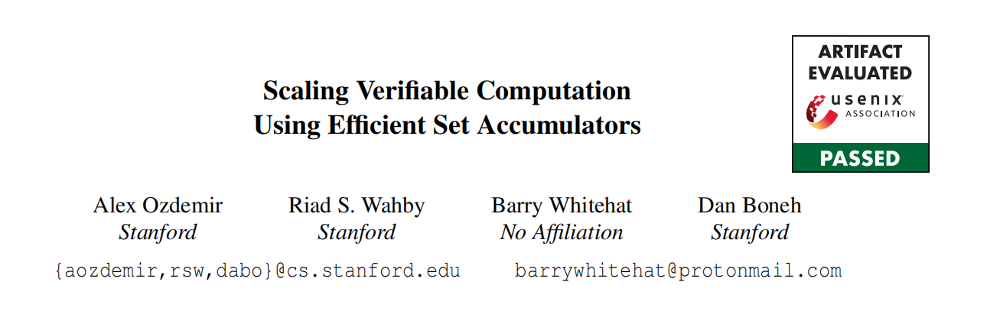

# Abstract

可验证的外包计算将大型计算卸下给一个远程服务器，但要求远程服务器提供一个简洁的证明，成为SNARK，来证明服务器已经正确执行了计算。这种方法的实际应用可以在几个区块链系统中找到，这些系统使用可验证的外包来处理大量链外的事务。这将链上的工作简化为简单地验证事务处理已正确完成的简洁证明。在实践中，可验证的状态更新外包是通过更新Merkle树的叶子，重新计算生成的Merkle根，并使用SNARK证明状态更新是正确完成的来完成的。

在这项工作中，我们使用现有技术和新技术的组合来在SNARK内部实现一个RSA累加器，并使用它作为Merkle树的替代品。我们特别优化了累加器与SNARKs的兼容性。我们的实验表明，与使用Merkle树进入当前状态的现有方法相比，所得到的系统降低了成本。这些结果广泛适用于任何需要将状态更新卸载到不受信任服务器的系统。

# Introduction

可验证的外包是一种技术，使弱客户端外包计算到一个强大的服务器。服务器返回计算的结果，并证明计算是正确完成的。证据必须简洁，这意味着它必须是简短和廉价的验证。可验证的外包在许多场景中都是相关的，包括弱物联网设备、可穿戴设备和低功耗设备。

最近，可验证的外包被部署在区块链环境中，因为链上的工作是昂贵的。在这里，一批k个事务，比如k = 1000，被外包给一个不受信任的服务器，称为聚合器，以进行处理。聚合器(1)验证事务是否有效（例如，正确签名），(2)计算由这些事务产生的更新的全局状态，(3)生成聚合器正确执行步骤(1)和(2)的证明。更新后的状态和简明扼要的证明随后被发送到区块链。.在这种方法中，（昂贵的）链上的工作被简化为只验证证明——这是快速的，花费的时间独立于事务的数量k——然后记录更新的状态。以这种方式操作的示例系统包括Rollup [7],Coda [89], Matter [86], and Zexe [29].

上述过程称为可验证的状态更新外包**verififiable outsourcing of state update** 。