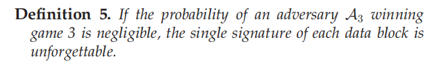
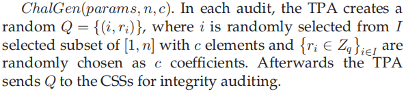

# Abstract

为了提高数据的可用性和持久性，云用户希望在服务器上存储其原始文件的多个副本。提出了多副本审计技术，为用户提供保证多个副本实际存储在云中。然而，大多数多副本解决方案都依赖于公钥基础设施（PKI），这需要大量的证书计算和管理开销。在本文中，我们提出了一种高效的多副本动态完整性审计方案，它采用了无证书签名（称为MDSS），消除了昂贵的证书管理开销，并避免了基于身份的签名中的密钥托管问题。具体来说，我们改进了经典的Merkle哈希树（MHT），以实现多拷贝存储的批处理更新，这允许动态操作所产生的通信开销独立于副本数目。

为了满足灵活的存储需求，我们提出了一种可变副本数量的存储策略，允许用户确定每个块的副本数量。基于审计人员可以诬陷云存储服务器（CSSs）这一事实，我们使用签名验证来防止恶意审计人员诬陷诚实的css。

最后，安全性分析证明了我们的方案在随机喻言模型中是安全的。分析和仿真结果表明，我们的方案比目前最先进的方案更有效。

# 1 Introduction

​		通过云存储模式，用户可以将数据上传到云中，删除本地副本，享受高质量的收费服务。但用户也不能再像处理本地数据那样管理这些数据。他们可能会担心云存储服务器（CSSs）不能正确地存储其数据。尽管支持CSSs的云存储提供商（CSP）声称用户的数据已经被正确存储，但为了保持其声誉而隐藏数据损坏事件符合他们的利益。因此，需要一个有效的机制，使用户能够检查云数据的完整性。

​		完整性审计技术被认为是允许用户验证云数据是否正确存储的有效手段。为了将用户从沉重的计算负担中解放出来，在完整性审计模型中引入了第三方审计员（TPA），以代表用户与云进行交互。目前所有的方案都主要集中在单副本的研究上。在单副本的方案中，尽管存在审计机制，但由于删除了本地副本，损坏的数据很难恢复。因此，多副本存储已成为提高数据可用性和可恢复性的必然选择，通过不同的CSS存储原始数据的多个副本。多副本存储的一个显著特征是，只要存储在云中的数据的一个副本保持完整，损坏的数据就可以被正确地恢复。因此，对于有价值的数据，如财务应用、科学研究材料和教育文件，有必要提供多副本存储，以避免数据丢失。

​		尽管现有的多副本提案[18], [19], [20], [21]都致力于提高审计效率，但所有这些提案都是在公钥基础设施（PKI）技术下构建的，这对用户来说是一个不经济的选择，因为在他们的模型中引入了大量的证书管理开销。尽管一些多副本方案 [22], [23]已经使用了基于id的签名[24] 来减少证书开销，但它们没有考虑数据动态操作的问题。一些早期的多副本研究成果[19], [21] 已经为所有副本实现了动态更新，但会遭受恶意css发起的替换攻击。另一个多副本动态构造 [20]被设计用于抵抗替换攻击，但它仅适用于逐个进行副本验证以定位损坏的副本的情况。此外，动态方案[19]、[20]、[21]中动态更新的开销总是随副本数线性增加，这在现实中是不现实的。因此，在抵抗替换攻击的同时，尽可能地降低多副本结构中的动态审计的成本是一个主要的障碍。

​		除了数据动态之外，可变副本数量的存储也是另一个值得考虑的实际需求。现有的多拷贝解决方案总是假设一个文件的所有块都被复制到相同的副本中进行存储。在实践中，原始文件中的一些块不包含有效的信息，而其他块则具有很高的价值。在这种情况下，用户可能被允许为低价值的块存储一个或两个副本，并为有价值的块存储更多的副本。文件中的每个块都将以不同的副本数量存储。目前，为多副本审计提供可变拷贝数量存储是一个令人兴奋的挑战。

​		此外，上述所有方案都总是假设CSS在完整性审计模型中不完全受信任。但事实上，用户和TPA也可能是不诚实的[25]，[26]。即使CSSs已经通过了验证，用户/TPA仍然可以声称验证不成功以此从CSP获得补偿。此外，TPA可能与CSSs串通，以向用户隐藏存储的数据已被损坏的事实，从而从CSP获取贿赂。因此，需要为多拷贝存储提供公平的仲裁服务。

​		为了解决这些问题，我们提出了一种高效的多拷贝完整性审计方案（MDSS），采用无证书签名[27]，实现了动态数据操作，并同时提供可变拷贝数量的存储。此外，我们的MDSS在动态更新过程中的通信开销与副本数量无关，这极大地提高了动态效率。

**我们的贡献**

	1. 据我们所知，我们是第一个使用无认证的签名实现多副本公共审计构造的，这避免了在PKI设置中使用昂贵证书的高成本和在使用基于id的签名中的密钥托管问题。
	2. 为了实现多副本模型的数据动态操作，我们设计了一种新的动态结构（称为MD-MHT），它同时支持块值和序列号验证。动态审计的开销不会随着副本的数量而增加。基于改进后的结构，提出了一种签名交换验证，以处理不诚实审计人员可能诬告CSS来获取赔偿的纠纷。
	3. 为了使用户在经济上受益，我们提供了一种针对不确定副本数量的存储策略。该策略允许用户确定不同数据块的副本数量，从而提高了多副本存储的效率和可行性。
	4. 我们给出了随机喻言模型中MDSS的可证明的安全性分析。此外，理论和实验分析表明，MDSS在通信和计算成本方面是高效的。

​	

**本文结构**

本文的其余部分组织如下：我们在第2节中概述了相关的工作。我们在第3节中介绍了系统和安全模型。然后，我们在第4节中提出了MDSS的动态结构和详细算法。可提供的安全性分析和性能评估将在第5节和第6节中进行。最后，我们在第7节中给出了我们的论文的结论。

# 2 Related Works

​		Ateniese等人[8]发明了可证明的数据占有（PDP）的概念，即审计员或用户本身可以验证存储在不受信任的服务器上的数据。发明了同态可验证的身份验证器，将许多证明聚合为一个常数值，实现了具有可接受的通信开销的批处理审计。然而，该方案仅适用于静态数据。

随后，Erway等人[9]对PDP模型进行了扩展，并首先提出了一种全动态的PDP结构，其中设计了基于排名的认证跳跃列表（RASL），以支持全动态更新。

Wang等人[10]提出了另一种基于Merkle哈希树（MHT）的动态解决方案。MHT是一种深入研究的可验证结构[28]，旨在有效、安全地证明一组元素是无损和不变的。不幸的是，只验证节点的哈希值使得改方案容易受到恶意CSS发起的的替代攻击。

此外，Zhu等人[11]通过设计的结构：索引哈希表（IHT），开发了另一种完全动态的云存储数据方案。但是，任何插入和删除操作都会导致标签重新计算位于被操作块后面的所有数据块，从而导致较高的计算成本。

随后，类似的解决方案[5]，[29]被提出来提高动态更新的效率。其他研究方面也被深入研究，如隐私保护[30]、[31]、用户撤销[32]、[33]、群组共享[34]、[35]、用户密钥更新[14]、[15]、基于雾的云[36]等。

为了缓解证书的使用问题，Li等人[37]对云数据进行了基于模糊身份的审计。

Shen等人[38]实现了基于身份的完整性审计，通过隐藏敏感信息进行安全共享。然而，由于基于身份密码系统的固有缺陷，上述方案存在密钥托管问题。

为了解决这个问题，Li等人[39]利用无证书签名来实现共享数据的完整性检查，其中不需要证书，同时消除了密钥托管问题。

最近，Zhang等人[40]提出了另一项公开可审计的提案，通过将无证书签名与区块链结合，实现了对拖延的审计人员的抵制。

---

​		为了实现多副本存储中的公共审计，Curtmola等人[18]提出了第一个基于RSA签名的多副本方案。不幸的是，不支持数据动态，因为在计算验证标签时涉及到块号。

为了支持动态更新，Barsoum等人[19]通过采用BLS签名，进一步提出了两个动态方案TB-DMCPDP和MBDMCPDP。然而，TB-DMCPDP和MBDMCPDP的成本随着副本数量的增加而增加。另外，TB-DMCPDP会受到恶意CSS发起的重放攻击。

Liu等人[20]还提出了一种称为MuR-DPA的多副本公共审计方案，通过改进经典MHT。MuR-DPR被设计用于逐个验证所有副本；因此，它给用户带来了大量的计算和通信开销。

Zhang等人[21]也提出了一种通过改进MHT的多副本动态结构。但是，改进后的哈希树的每个节点存储了四个元素，这为公共审计中的动态更新引入了额外的通信开销。

Peng等人[22]将基于id的签名引入多副本审计，从而减少了认证证书的使用。在副本生成阶段，副本号和块号用于生成可微的多个副本，因此模型不能支持数据动态。

最近，Li等人[23]在多云存储中提出了另一种基于身份的多副本方案，该方案跨多个css存储多个副本。

---

​		综上所述，大多数现有的多副本提案会导致证书管理的高开销，因为它们是用PKI技术设计的，而基于id的签名的结构存在固有的密钥托管问题。此外，所有动态多副本方案都存在效率低下，即更新成本随着副本数量的增加而线性增加。因此，我们需要设计一种有效的动态多拷贝完整性审计方案，其中动态的开销与复制副本数量无关。

# 3 System and Security Model

在本节中，我们将介绍该提案的系统和安全模型。在表1中定义了本文的其他符号和描述。

## 3.1 System Model

我们的多副本公共审计模型，如图1所示，包含五个实体：一个数据所有者（DO），一个TPA，几个由CSP支持的CSS，一个KGC，和一个可信的仲裁实体TAE。他们的责任和义务如下。

- DO：由$ID_O$标识的DO生成对低价值数据块的少量副本以及高价值块的多个副本，然后将所有的块上传到CSS中保存。为了保护数据完整性，DO需要使用他的私钥为每个数据块生成一个标签。
- TPA：TPA是一个比用户拥有更多的计算资源和专业知识的实体。在获得DO批准后，它会为完整性审计发起一个随机的挑战。
- CSSs：CSS是具有强大计算能力和足够存储空间的资源中心。CSS负责存储数据，并随时响应来自DO或TPA的挑战。在这里，我们假设所有的CSSs都由一个CSP支持，这意味着所有的CSSs共享相同的密钥对和身份$ID_C$。
- KGC：KGC负责根据给定的身份，为完整性系统中的其他实体生成部分私钥。
- TAE：TAE是在模型中提供公平仲裁服务的受信任方。事实上，TAE可以是一个值得信赖的政府机构。

---

**定义1**

我们的MDSS系统可以通过运行一个四个阶段的MDSS方案来实现，如图2所示。其中设置阶段将在系统开始时执行，对于DO拥有的一个文件只执行一次；证明阶段和更新阶段可以以任意顺序执行多次。仲裁阶段将在证明阶段或更新阶段至少运行一次之后运行。具体来说，我们的MDSS方案由10种算法组成，描述如下：

- $KeyGen(1^\lambda)$：该算法在KGC和DO/CSSs之间运行，以生成密钥对和系统参数，这将在以下算法中使用。

- $CopyGen(F,name,n,m_i,m_max,sk_O)$：该算法由DO运行，为每个块生成$m_i$个不同的副本。

- $TagGen(params,b_{ij},sk_O,ID_O,name,m_i,m_{max})$：该算法由DO运行，以生成可验证的标签、MD-MHT、根和根上的签名。
- $Store(b_{ij},\sigma_i,sk_O,Sig_{R_O})$：该算法在DO和CSSs之间运行，来协定上传信息。它输出1或0，其中1/0表示DO和CSSs同意/不同意上传数据。

- $ChalGen(params,n,c)$：该算法由DO/TPA运行，生成一个随机挑战Q。
- $ProofGen(Q,params,name,c,b_{ij},\sigma_i, pk_O)$：该算法由CSS运行，生成完整性证明P。
- $ProofVerify(P,pk_O,ID_O,params)$：该算法由DO/TPA运行来验证证明P。该算法输出一个决策比特$b\in{0,1}$，其中1/0表示CSSs通过/不通过DO/TPA的验证。
- $DynaGen(name,b_{ij},\sigma_i)$：该算法由DO运行，以生成一个动态请求req。
- $DynaVerify(req,params,sk_O,F,name)$：该算法由DO运行，输出一个决策比特$b_1\in{0,1}$，其中1/0表示DO批准/不批准CSSs的动态更新操作。
- $ArbitrationJud(Sig_{R_C},R_O,R_{TPA},R_{TAE})$：该算法由TAE运行，输出一个决策比特$b_2\in{-1,0,1,2}$，分别表示不诚实的CSS/DO/TPA，2表示DO和TPA都不诚实的情况。

## 3.2 Security Model

首先，我们将给出两个安全假设，为后续可证明的安全分析提供基石。

由于我们的MDSS是基于无认证的签名构建的，所以我们考虑了三种类型的攻击者，A1、A2和A3。

A1尝试伪造一个块的标记，A1具有用任何选定值替换DO的公钥的能力，但无法访问主密钥。

A2尝试伪造文件块的标签，A2拥有主私钥，但不能替换DO的公钥。

A3尝试伪造一个完整性证据来欺骗DO。

在这里，我们分别通过挑战者C和三种对手之间的三个游戏来定义我们的安全模型。

---

Game1: 挑战者C和敌手A1进行交互。
	Setup：C执行系统初始化，获得公开参数params和主私钥msk。然后C将params发送给A1，并自己保留msk。

​	Queries: A1可以向C发起一系列询问，C回答A1的询问如下。
​		1）Hash Queries：A1适应性地向C发起哈希询问，C返回给A1对应的哈希值。
​		2）Partial-Key Queries：A1适应性地向C发送一些选定的$ID_s$。C返回给A1对应的部分私钥。
​		3）Secret-Value Queries：A1适应性地向C发送一些选定的$ID_s$。C返回给A1对应的秘密值。
​		4）Public-Key Queries：A1适应性地向C发送一些选定的$ID_s$。C返回给A1对应的公钥。
​		5）Public-Key Replace：A1可以用任何值替换标识为ID的用户的公钥。
​		6）Copy Queries：A1适应性地选择一些块发送给C，来获得它们的副本。C运行CopyGen算法把副本发送给A1。
​		7）Tag Queries：A1适应性地选择元组$(b,ID)$发送给C，目的是获得文件块b由用户ID计算的标签。C执行TagGen算法来产生b的标签并返回给A1。

​	Forge：A1输出一个对文件块b'的所有部分的签名$\sigma'$，使用身份ID'和公钥$pk_{ID'}$。如果达到以下条件，A1将赢得游戏：

​		1）使用身份ID'和公钥$pk_{ID'}$对b'的签名$\sigma'$是有效的。

​		2）A1没有询问过ID'的完整私钥

​		3）A1没有询问过ID'对应的部分私钥，并替换ID'的公钥。

​		4）A1没有查询过(ID',b')的标签值。

---

Game2：C和A2进行交互，与Game1相似但有一些不同：(1)在setup阶段，C把params和msk都发送给A2；(2)C不会做部分私钥询问和公钥替换。

​	Forge：A2输出一个对文件块b'的所有部分的签名$\sigma'$，使用身份ID'和公钥$pk_{ID'}$。如果达到以下条件，A2将赢得游戏：

​		1）使用身份ID'和公钥$pk_{ID'}$对b'的签名$\sigma'$是有效的。

​		2）A2没有对ID'进行过秘密值询问。

​		3）A2没有查询过(ID',b')的标签值。

---

**定义4**

---

Game3：C和A3交互。这里的A3可以视作不可信的CSSs。Game3聚焦于CSSs是否可以在没有准确数据的情况下伪造审计证明。游戏过程定义如下：

- setup：C执行KeyGen算法获得msk，params以及用户的私钥。然后C保留msk和用户私钥，将params发送给A3。
- CopyGen：A3适应性地发送元组$(b,ID,m_b)$给C来获得副本${b_l}_{1\leq l \leq m_b}$，这里的$m_b$指的是文件块b的副本数。C运行CopyGen算法创建b的$m_b$个副本并发送给A3。
- Challenge：C提交一个随机挑战Q给A3，要求A3回答对应的完整性证明。
- Forge：A3生成Q对应的完整性证明P。如果P能通过C的认证，我们说A3获胜。

**定义5**

# 4 Our Proposed Scheme

在本节中，我们将描述多重副本更新的动态结构，命名为MD-MHT。然后我们解释了我们的方案是如何基于MD-MHT来构建的。

## 4.1 Designed Dynamic Structure MD-MHT

我们的MD-MHT是通过使用一个加密哈希函数H来构造的。

MD-MHT的每个节点存储三个元素：哈希值$h_N$和位置信息$(l_N,p_N)$，其中$l_N$表示节点的层高信息，$p_N$表示节点在该层的位置信息。为了给每个节点提供唯一的位置信息，MD-MHT被标记为从上到下的层次信息和从左到右的位置信息。

与传统的MHT相比，我们的MD-MHT具有以下优点。

(1) MD-MHT显著降低了多副本更新的成本。假设使用MHT支持一个副本更新的成本为 t，而使用MHT支持m个副本更新的成本为m*t。相比之下，使用我们的MD-MHT进行多拷贝更新的成本与m无关，它略大于t因为每个节点需要存储少量的位置信息。(2)只验证哈希值使MHT遭受替换攻击，而我们的MD-MHT支持同时验证值和位置，以抵抗替换攻击。

在MD-MHT中，将一个块的所有副本的聚合哈希值作为叶节点的值。对于每个非叶节点，
$$
h_N = H(h_{lchildren}||h_{rchildren}||H(l_N||p_N)), 

l_N = l_{lchildern} -1 = l_{rchildren} -1,

p_N=\lceil p_{lchildren}/2 \rceil=\lceil p_{rchildren}/2 \rceil,
$$
根节点的位置信息为null，即$l_R=p_R=null$。

根据从下到上的顺序，很容易得到所有节点的散列值和位置信息来构建我们的MD-MHT。同时，验证路径定义为从节点到根的路径上的兄弟节点。

## 4.2 Construction Of Our Proposal

基于MD-MHT，我们构建了一个方案，其中所有的算法运行如下。

### 4.2.1 Setup Stage

---

DO和CSSs与KGC交互，通过运行KeyGen算法来获得他们的公私钥对。

对于$F=\{{b_i}\}_{1 \leq i \leq n}$，DO运行CopyGen算法为每一个块生成$\{b_{ij}\}_{1 \leq j \leq m_i}$。

然后DO使用TagGen算法对$b_i$所有的副本生成一个聚合标签$\sigma_i$，创建一个MD-MHT树并产生一个签名$Sig_{R_O}$。

最后DO将$(\{b_{ij}\},\{ \sigma_i\},MD-MHT,Sig_{R_O})$上传到CSSs，同时删除除了$R_O$以外的本地存储。CSSs验证上传数据的有效性，如果验证通过，执行Store算法接受数据。

DO获取公私钥对的过程：

CSS获取公私钥对的过程：

DO执行CopyGen算法生成副本

DO执行TagGen算法生成标签：

CSSs执行Stroe算法过程：

DO将所有的文件块、对应的标签以及MD-MHT树和对根节点的签名$Sig_{R_O}$发送给CSSs用于存储，并删除除了$R_O$以外的本地数据。

CSSs收到数据后，首先验证块和标签的一致性：

如果验证失败，CSSs拒绝存储DO的数据，算法输出0。

否则，CSSs基于MD-MHT计算出根节点$R_C$，并验证$Sig_{R_O}$的有效性，通过$e(Sig_{R_O},g)=e(H_4(R_C),pk_O)$

如果验证失败，算法终止并输出0；

否则，CSSs存储所有的相关数据，生成$Sig_{R_C} = H_4(R_C)^{sk_C}$发送给DO。

DO验证$Sig_{R_C}$的有效性，通过$e(Sig_{R_C},g)=e(H_4(R_O),pk_C)$。

如果验证通过，算法输出1；表示DO相信CSSs诚实地存储了MD-MHT；否则，算法终止并输出0。

之后，DO会将他存储的根节点$R_O$发送给TAE和TPA，TAE和TPA都会存储根节点$R_{TAE}/R_{TPA} = R_O$。

### 4.2.2 Proof Stage

证明阶段包括多个证明环节。在每个证明环节，如图4所示，TPA首先通过ChalGen算法计算一个随机挑战Q。基于Q，CSSs通过ProofGen算法生成完整性证据P。TPA通过ProofVerify算法检查P的有效性。

TPA执行ChalGen算法

CSSs执行ProofGen算法

TPA执行ProofVerify：

### 4.2.3 Update Stage

对于每一次更新，DO通过运行DynaGen算法发送一个更新请求req给CSSs。

一旦收到req，CSSs更新存储的数据并计算一个更新证明$P_{dy}$作为回应。

然后DO会运行DynaVerify算法来决定是否同意CSSs的更新操作。更新阶段的细节如图5所示。

在我们的方案中，通过Modification，Insertion和Deletion算法实现了三种更新操作。

以前的数据更新仅仅要求DO验证CSSs返回的更新证据。如果验证通过，DO相信CSSs诚实地执行了更新操作。而我们的构造中，DO和CSSs都需要同意每一次更新操作，这可以防止DO诬陷诚实地进行了更新操作的CSSs。

DO执行DynaGen算法：

CSSs执行DynaVerify算法：

Modification：

Insertion操作

Deletion操作

### 4.2.4 Arbitration Stage

