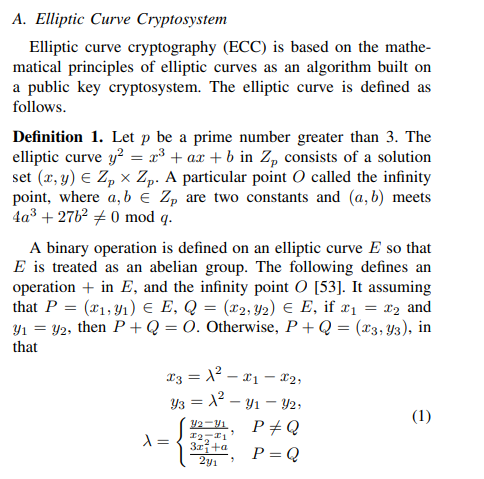
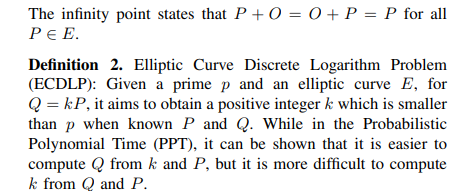

# 椭圆曲线密码学

# 4 方案构造

**阶段1**：用户和KGC交互来决定自己的公钥对，并实现数据的安全外包。

**系统初始化Setup**：输入一个安全参数 $k$ ，KGC按照如下步骤生成系统参数。

1. 选择两个大素数 $p$ 和 $q$ ，定义一个有限域 $F_P$ 上的椭圆曲线 $E$ 。令 $P$ 是一个 $q$ 阶椭圆曲线加法循环群 $G = 
 $ 的生成元。

2. 选择一个随机值 $s \in Z_q^*$ 作为系统的主密钥，计算 $P_{pub} = sP$ 作为对应的公钥。

3. 设置一个伪随机函数 $Prf: Z_q^* \times \{1,2,...,n\} \times Z_q^* \rightarrow Z_q^*$ 和一个伪随机生成器 $Prg: Z_q^* \times \{1,2,...,n\} \rightarrow \{1,2,...,n\} $ 。

4. 定义安全哈希函数：
   $$
   \begin{equation*}
   \begin{split}
   & h_2: \{0,1\}^l \times G  \rightarrow Z_q^* \\
   & h_3: \{0,1\}^l \times \{0,1\}^* \times \{1,2,...n\} \times Z_q^* \rightarrow Z_q^* \\
   & h_4:  \{0,1\}^l \times Z_q^* \times \{1,2,...n\} \times G \times G \rightarrow Z_q^* \\
   & h_5: \{0,1\}^l \times Z_q \times G \times Z_q^* \rightarrow Z_q^* \\
   \end{split}
   \end{equation*}
   $$
   
5. 公开参数$Para = (p,q,E,P,P_{pub},Prf,Prg,h_2 - h_5)$, 保留自己的主私钥 $s$ 。

---

**部分私钥生成Partial-KeyExtract**:KGC执行下面的算法步骤来生成用户的部分私钥。

选择一个随机值$r \leftarrow Z_q^*$，计算$R=rP， \mu = r +sh_2(ID,R) \quad (mod \quad q) $，通过安全信道发送部分私钥 $D = (\mu,R)$给用户。

---

**用户密钥设置算法UserKey-Set：**

1. 一旦接收到KGC发送的部分私钥$ D = (\mu,R)$,用户先通过下面的式子验证部分私钥的正确性。

$$
\mu P \overset{\text{?}}{=} R + h_2(ID,R) \cdot P_{pub} \tag1
$$

​	如果成立，用户接受KGC发来的部分私钥。否则，KGC重新生成部分私钥。

2. 用户随机选取一个 $x\in Z_q^*$ 作为秘密值，设置自己的私钥 $SK = (x,\mu)$。
3. 计算 $X = xP$，令$PK = \{X,R\}$作为公钥。

---

**TagGen and DataOutSourcing**: 用户执行下面的算法步骤来实现数据的安全外包存储：

给定一个文件$F=\{m_1,m_2,...m_n\} \in Z_q^*$，文件名为$Fname$。

1. 用户计算文件的标识符 $\tau = h_3(ID,Fname)$
   
1. 选择一个随机值$\alpha_i \leftarrow Z_q^*$，$PU$计算$\beta_i = \alpha_i P,  \psi_i = h_4(ID,\tau,i,PK) $。然后用户数为每个$m_i$生成签名块标签:
   $$
   \delta_i = x\psi_i +(\alpha_i + \mu) \ m_i \quad (mod \quad q) 
   $$
   这里的$i\in[1,n]$。

2. 输出整个$F$签名块标签$\phi = \{(\beta_i,\delta_i)\}_{1 \leq i \leq n }$，然后用户发送存储数据$\Omega = (ID,Fname,F,\phi)$给$CS$。

3. 一旦收到用户发来的存储数据$\Omega$，$CS$首先需要计算文件的标识符 $\tau = h_3(ID,Fname)$，然后验证原始的存储数据的完整性，通过下面的验证等式：
   $$
   \sum_{i=1}^{i=n} \delta_i P \overset{\text{?}}{=} X \cdot \sum_{i=1}^{i=n} \psi_i + \sum_{i=1}^{i=n} \beta_i m_i  + W \cdot \sum_{i=1}^{i=n} m_i \tag3
   $$
   这里的$\psi_i = h_4(ID,\tau,i,PK),\ W= R + h_2(ID,R) \cdot P_{pub}$

5. 如果验证等式不成立，$CS$拒绝存储数据$\Omega$；否则，$CS$接受存储数据$\Omega$。

最后用户清空本地存储$\Omega$。

---

**Phase 2**: TPA代表用户定期地检查外包数据的完整性。

$ChallengeGen$: 为了检查外包存储数据的完整性，TPA生成如下的审计挑战消息：

​	TPA选择一个随机的 $Q = \{(i,v_i)\}$，其中 $ i \in I$，$I$ 是$[1,n]$包含$c$个不同元素的子集；$\{v_i \in Z_q*\}$ 是随机选取的$c$个随机数。

​	TPA发送如下的挑战信息给CS。
$$
\begin{equation*}
\begin{split}
Chal = \{ ID, Fname, Q=\{(i,v_i)\}_{ i\in I} \}
\end{split}
\end{equation*}
$$

---

$ProofGen$: 一旦收到验证者发送的$Chal$，CS按如下步骤计算响应的审计证据：

1. 基于文件的位置标志$\{ID,Fname,i\} \quad  i \in I$，CS准确地定位对应的医疗数据文件$F$，并进一步检索被挑战的数据块$m_{i}$以及它的签名块标签$(\beta_{i},\delta_{i})$。之后，对每一个$i_j$，CS计算$\psi_{i} =  h_4(ID,\tau,i,PK) $。

2. 计算
   $$
   \begin{equation*}
   \begin{split}
   &  W= R + P_{pub}h_2(ID,R) \cdot 
   \\
   \\
   & Y=W \sum_{i \in I} v_{i} m_i \\ 
   \\
   & \xi = \sum_{i \in I} v_{i} m_i \beta_{i} \\
   &\\
   & \delta = \sum_{i \in I}v_i\delta_i
   \end{split}
   \end{equation*}
   $$
   
3. 发送完整性证据 $Proof = (Y,\xi,\delta)$给TPA。

---

$ProofVerify$: 拥有$Chal$和$Proof$，验证者通过如下步骤检查外包数据的完整性：

1. 计算
   $$
   \begin{equation*}
   \begin{split}
   
   & \tau = h_3(ID,Fname) \\ 
   & \psi_i = h_4(ID,\tau,i,PK)
   
   \end{split}
   \end{equation*}
   $$
   
2. 检查是否下面的完整性验证等式成立：
   $$
   \begin{equation*}
   \begin{split}
   \delta P \overset{\text{?}}{=} X \cdot \sum_{j=1}^{j=c} v_{i} \psi_i   + \xi + Y
   \end{split}
   \end{equation*}
   $$

3. 如果上式成立，验证者输出验证结果为"1", 否则输出"0"。

