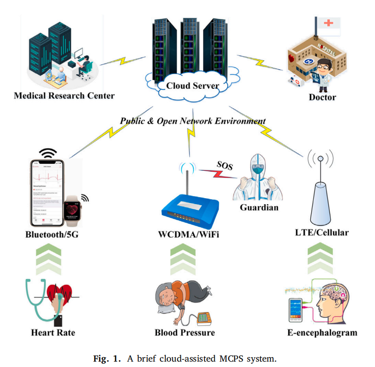
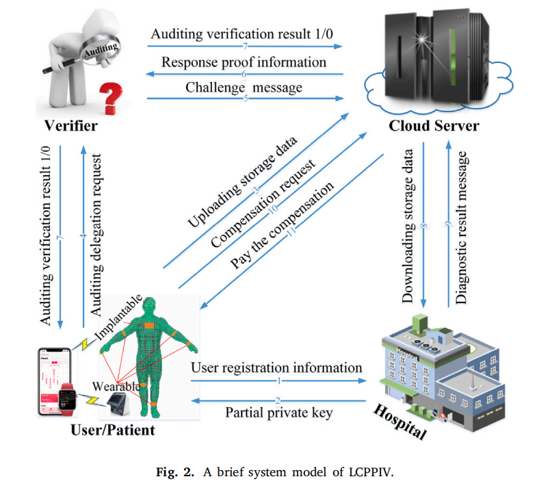

**Lightweight certificateless privacy-preserving integrity verification with conditional anonymity for cloud-assisted medical cyber–physical systems**

*Journal of Systems Architecture （CCF B）*

---

# 摘要

云辅助医疗网络物理系统（MCPSs）利用云计算的能力，对外包的医疗数据进行可扩展的存储和管理。基于关键的外包医疗数据，监护人可以及时了解患者的健康状况，医生可以对患者做出准确的诊断，医学研究中心也可以进行医疗大数据分析。然而，医疗数据是高度敏感的，需要得到很强的保护。同时，外包医疗数据的完整性也容易受到硬件故障、软件错误或人为错误的影响。迄今为止，已经有大量的隐私保护的完整性审计方案被提出，但大多数都面临这复杂的公钥证书管理问题，或基于身份的密码学中的密钥托管问题。本文通过开发一种椭圆曲线数字签名和密钥交换机制，提出了一种对云辅助的MCPSs有条件匿名的功能的轻量级无证书的隐私保护的完整性验证方案(LCPPIV)，实现了医疗数据的隐私保护、外包数据完整性验证、条件匿名、批量审计和安全的赔偿机制等功能。理论安全性分析表明，我们的方案在随机喻言模型中是可证明安全的，能够抵抗公钥替换攻击、恶意但被动的KGC攻击和响应审计证明伪造。性能评估表明，与最先进的数据审计方案相比，LCPPIV对于云辅助的MCPSs更为实用。

# 1 介绍

近年来，医疗网络物理系统（MCPSs）在提高医疗质量和提供多种医疗保健服务方面发挥了重要作用`[1-3]`。MCPSs可以利用各种类型的智能传感器或医疗设备来收集患者的重要身体参数，并持续监测其健康状况，这大大方便了医生对患者做出准确的诊断。然而，对患者进行持续监测并在本地记录他们的医疗数据将造成沉重的存储和管理负担。同时，MCPSs中患者的医学数据不仅包含基本的生理特征（如温度、呼吸频率、血压、心率等），但还有大量的图像数据，如脑电图和x射线。这些收集到的医疗数据需要可以被远程医生方便地访问，以便及时为患者提供诊断和反馈治疗信息。为了减轻本地存储和管理的负担，并允许无处不在的数据访问，采用可以提供巨大的数据存储空间和强大的计算能力的云计算是一个自然的选择`[5]`。图1演示了一个由云辅助的MCPS的体系结构。使用各种医疗传感器的患者定期将收集到的医疗数据上传到云服务器，以便通过公共网络进行长期存储。监护人可以实时了解患者的健康状况，医生可以随时随地访问云中相关患者的医疗数据，并及时将最终诊断结果反馈给相应的患者。此外，为了对某些未知疾病进行正确的诊断，可信的医学研究中心也可以借助云计算进行医学大数据分析。

虽然云辅助的mcps为云用户提供了巨大的好处，但在将医疗数据外包给云时，也出现了各种安全问题。其中，医疗数据隐私保护`[6,7]`和外包数据的完整性验证`[8,9]`是两个亟待解决的问题。一方面，医疗数据高度敏感，需要很强的保护，因此数据外包的首要任务是确保医疗数据的条件性。另一方面，云数据存储的完整性也容易受到不可避免的硬件故障或软件错误的影响，这可能会破坏患者的外包数据。实际上，云服务器提供商（CSP）可以删除用户（包括患者和医生）很长时间没有访问过的医疗数据，以节省存储空间，但声称这些医疗数据是完整的。实际上，云服务器提供商（CSP）可以删除用户（包括患者和医生）很长时间没有访问过的医疗数据，以节省存储空间，但也可以声称这些医疗数据是完整的。显然，即使是轻微的数据修改或丢失也可能导致患者的误诊，甚至死亡的威胁`[10]`。因此，定期检查外包医疗数据的完整性是一个必要的要求。

数据完整性审计机制`[11]`可以有效地检查存储在云服务器上的医疗数据是否完整。到目前为止，已经提出了大量的数据完整性审计方案`[12-17]`，但大多数是构建在公钥基础设施（PKI）或基于身份的公钥加密（ID-based PKC）上的。这些方案存在公钥证书管理的问题，或面临密钥托管的固有缺陷。无证书公钥加密（CPKC）`[18]`是同时解决公钥证书管理和密钥托管问题的一个很好的选择，但它也面临着几种类型的协议漏洞攻击和高性能的开销`[19]`。同时，CPKC中的密钥生成中心可能是一个具有被动和妥协特征的半可信实体，这使得它无法像基于id的PKC那样参与患者的身份匿名性计算。众所周知，在云辅助的mcps中，患者的身份隐私与医疗数据隐私一样重要。这是因为患者不希望其他人（除了医生）了解他们与某些严重疾病有关的真实身份，也不愿将这些与他/她的敏感身份相关的医疗数据提供给他人。为了实现患者的身份隐私，并进一步跟踪和揭示有恶意行为的患者的真实身份，在实际的云辅助MCPSs中，一种安全有效的具有条件匿名的无证书隐私保护的完整性验证更具吸引力。

除了上述障碍之外，我们还注意到，即使是许多研究人员对数据恢复和身份匿名`[20]`的数据完整性审计机制进行了深入的研究，他们也没有考虑补偿机制。实际上，当验证者的数据审核验证结果为“𝐹𝑎𝑙𝑠𝑒”时，云服务器不仅要快速定位并恢复损坏的数据块，还要向相应的患者支付补偿。对于患者，他们需要向云服务器证明他/她是真实的数据上传者，而不透露任何敏感的身份信息。因此，当存储在云服务器上的医疗数据确实被损坏时，如何在不透露患者身份信息的情况下安全地补偿真实数据上传器是一个重要的需求。

综上所述，本文中我们做出了以下贡献：

- 我们确定了传统的mcps所面临的安全性和性能挑战。在此基础上，通过开发椭圆曲线数字签名，提出了一种基于云辅助监控系统的轻量级无认证隐私保护完整性验证方案（LCPPIV），并进一步形式化了其系统模型和安全模型。同时，我们还对LCPPIV进行了性能分析和评价。结果表明，我们的方案在云辅助的MCPSs中更加实用。特别是，LCPPIV不仅显著降低了医疗数据块的签名计算成本，而且在验证者的数据审计挑战-验证过程中实现了轻量级的性能开销。
- LCPPIV利用一种安全的密钥交换机制，实现了患者的有条件的身份隐私。除了医院之外，云辅助mcps中的任何人都不知道患者的真实身份。即使一个敌手（包括CSP和验证者）打破了密文的不可识别性`[21]`，并获得了明文信息，它也无法推断出谁真正拥有相应的医疗数据。同时，当一些恶意患者滥用云辅助的MCPSs或假装是他人向云服务器索赔时，LCPPIV也可以有效地跟踪和撤销行为不当的患者的真实身份。
- 我们证明了LCPPIV是可靠的，并提供了随机喻言模型中详细的安全证明，包括抵抗公钥替换公里、抵抗恶意但被动的KGC的攻击、存储正确性保证、患者的条件匿名性、医疗数据的隐私保护和安全补偿。任何对手都不能成功地建立一个有效的数据块标签来通过原始存储数据的正确性验证。此外，如果外包的医疗数据被损坏，恶意的云服务器无法输出有效的响应审核证明来欺骗验证者。

# 3 技术准备

## 3.1 椭圆曲线密码学和困难问题

椭圆曲线密码学（ECC）是密码学中应用最广泛的算法之一，具有相对良好的安全性和极高的效率。根据美国国家标准局和ANSI X9确定的最短键长度要求`[4]`，在相同的安全强度下，Rivest-Shamir-Adleman（RSA）和数字签名算法（DSA）的密钥大小均为1024位，而基于ECC的密钥长度仅为160位。同时，与双线性配对映射（BPM）相比，ECC不产生耗时的双线性配对运算和模指数运算。因此，ECC可以完美地用于资源有限的医疗物联网的应用场景。现在，我们提供了椭圆曲线和基于ecc的离散对数问题（ECDLP）的形式化定义如下：

**定义 1. **椭圆曲线定义：椭圆曲线$\mathbb{E}$表示weuerstrass定义的曲线方程的系数都是有限域$\mathbb{F}_p$中的元素，其中$p$是一个大素数。$\mathbb{F}_p$上的$\mathbb{E}$可以被定义如下：$y^2 = x^3 + ax + b \quad mod \quad p$,其中$a,b \in \mathbb{F}_p, 0 \leq \lt q , \Delta = 4a^3 + 27b^2 \neq 0 \quad mod \quad p$

**定义 2.** 基于$ECC$的离散对数问题($ECDLP$)：给定两个大素数$p$和$q$，定义一个$\mathbb{F}_p$上的椭圆曲线$\mathbb{E}$。假设$P$是$\mathbb{E}$的一个点，$P$是$q$阶加法循环群$G=
$的生成元。对于任意的元素$D \in G$, $ECDLP$的目标是在概率多项式时间内找到一个随机整数$d \in Z_q^*$，满足$D = dP$

## 3.2 系统模型

## 3.3 方案定义

LCPPIV的正式定义如下：

**定义 3.** 提出的LCPPIV方案由9种$PPT$算法组成：Setup, Secret-ValueSet and Anonymous-IDGen, Partial-KeyExtract, Pubilc-KetSet, TagGen and DataOutsourcing, ChallengeGen, ProofGen, ProofVerify, Compensation Identify。

**Setup**：该PPT算法由医院执行，医院输入一个安全参数$𝜐$。医院输出系统公共参数$𝑃𝑎𝑟𝑎$和主私钥$𝑠$。

---

**Secret-ValueSet and Anonymous-IDGen**: 该$PPT$算法由患者$PU$操作，它以唯一的真实身份$𝑖𝑑$和系统公共参数$Para$作为输入。$PU$输出秘密值$𝑥$及其匿名身份$Aid$。

---

**Partial-KeyExtract**: 该$PPT$算法由医院执行，以患者的注册信息$Reg$、系统公共参数$Para$和主私钥$s$作为输入。医院输出$PU$的部分公钥/私钥对$(R,\mu)$。

---

**Pubilc-KetSet**： 该$PPT$算法由患者$PU$执行，它以秘密值$x$和部分公钥$𝑅$作为输入，输出相应的公钥$PK = \{X=xP,R\}$。

---

**TagGen and DataOutsourcing**: 这个$PPT$算法由$PU$操作，它接受一个文件名为$𝐹𝑛𝑎𝑚𝑒$的医疗数据文件$𝑀$，公私钥对$PK,SK=(\mu,x)_{Aid}$和系统公共参数$𝑃𝑎𝑟𝑎$作为输入。$PU$输出存储数据$\Omega$及其自认证信息$\sigma$。

---

**ChallengeGen**： 该$PPT$算法由验证者执行，以某个患者的审计任务请求$Req$作为输入。验证者输出最终的审计挑战消息$Chal$。

---

**ProofGen**: 该$PPT$算法由$CS$执行，它以审计挑战消息$𝐶ℎ𝑎𝑙$、存储数据$\Omega$和系统公共参数$Para$作为输入。$CS$输出响应审计证明$Proof$。

---

**ProofVerify**：该$PPT$算法由验证者执行，它以审计挑战消息$𝐶ℎ𝑎𝑙$、响应审计证明$𝑃𝑟𝑜𝑜𝑓$、患者的公钥$𝑃𝐾$和系统公共参数$𝑃𝑎𝑟𝑎$作为输入。验证者输出最终的审计结果“1∕0”。

---

**Compensation Identify**：该$PPT$算法由一个补偿请求者（指一些患者）和$CS$交互式执行，$CS$以审计结果“0”、患者的公钥$𝑃𝐾$和$PU$的自认证信息$\sigma$作为输入。$CS$输出补偿请求者的认证结果。

## 3.4 安全模型

# 4 方案构造

构造一个轻量级的无证书的对于云辅助的MCPSs有条件匿名的隐私保护的完整性验证方案。

由三个阶段组成：

**阶段1**：每个病人和医院交互来决定自己的公钥对，并实现医疗数据的安全外包。

**Setup**：输入一个安全参数 $v$ ，医院按照如下步骤生成系统参数。

1. 选择两个大素数 $p$ 和 $q$ ，定义一个有限域 $F_P$ 上的椭圆曲线 $E$ 。令 $P$ 是一个 $q$ 阶加法循环群 $G = 
 $ 的生成元，$ |p| = |q| = \lambda$ 。

2. 选择一个随机值 $s \in Z_q^*$ 作为系统的主密钥，计算 $P_{pub} = sP$ 作为对应的公钥。

3. 设置一个伪随机函数 $Prf: Z_q^* \times \{1,2,...,n\} \times Z_q^* \rightarrow Z_q^*$ 和一个伪随机生成器 $Prg: Z_q^* \times \{1,2,...,n\} \rightarrow \{1,2,...,n\} $ 。

4. 定义七个安全哈希函数：
   $$
   \begin{equation*}
   \begin{split}
   & h_1: G \times \{0,1\}^* \rightarrow \{0,1\}^l \\
   & h_2: \{0,1\}^l \times G \times G \times G  \rightarrow Z_q^* \\
   & h_3: \{0,1\}^l \times \{0,1\}^* \times \{1,2,...n\} \times Z_q^* \rightarrow Z_q^* \\
   & h_4:  \{0,1\}^l \times Z_q^* \times \{1,2,...n\} \times G \times G \rightarrow Z_q^* \\
   & h_5: \{0,1\}^l \times Z_q \times G \times Z_q^* \rightarrow Z_q^* \\
   & h_6: \{0,1\}^l \times \{0,1\}^* \times Z_q^n \times G \times G \times G\rightarrow Z_q^* \\
   & \hbar: \{0,1\}^* \rightarrow \{0,1\}^*
   \end{split}
   \end{equation*}
   $$

5. 公开参数$Para = (p,q,E,P,P_{pub},Prf,Prg,h_1~h_6,\hbar)$, 保留自己的主私钥 $s$ 。

---

**Secret-ValueSet and Anonymous-IDGen**: 假设每一个病人 $PU$ 有一个唯一的真实身份 $id \in \{0,1\}^l$, 生成秘密值和匿名身份的算法运行如下：

1. 除了唯一的真实身份 $id$, $PU$首先设置一个初始登录密码$PW =\{0,1\}^l$。然后选择一个随机数$x \leftarrow Z_q^*$，计算$X=xP$，然后生成他的匿名身份：
   $$
   Aid = h_1(xP_{pub},ST)\oplus id \tag{1}
   $$
   这里的$ST$表示$Aid$的有效期。

2. 通过安全信道提交用户注册信息$Reg=(Aid,PW,X,ST)$给医院。

---

**Partial-KeyExtract**: 一旦受到用户注册信息$Reg$，医院执行下面的算法步骤来生成$PU$的部分私钥。

1. 医院使用系统主密钥s，恢复出病人（用户）的真实身份：
   $$
   id=h_1(sX,ST) \oplus Aid \tag2
   $$

2. 重置用户的登录密码 $\Lambda =\hbar(id||PW) $，并将登录信息$(Aid,\Lambda)$加入到用户注册列表，这里的$||$表示每个部分的连接。

3. 选择一个随机值$r \leftarrow Z_q^*$，计算$R=rP$。然后医院返回部分私钥给$PU$:
   $$
   \mu = r +sh_2(Aid,P_{pub},X,R) \quad (mod \quad q) \tag3
   $$

4. 通过安全信道发送元组$(\mu,R)$给$PU$。

---

**Public-KeySet**: $PU$运行如下算法返回他的公钥。

1. 一旦受到医院发送的元组$(\mu,R)$，$PU$验证部分私钥的正确性，通过以下等式：  
   $$
   \mu P \overset{\text{?}}{=} R + h_2(Aid,P_{pub},X,R) \cdot P_{pub} \tag4
   $$
   如果成立，$PU$就接受它；否则，医院重复上面的步骤为$PU$重新生成部分私钥。

2. 令$PK = \{X,R\}$作为公钥。

---

**TagGen and DataOutSourcing**: $PU$执行下面的算法步骤来实现医疗数据的安全外包：

1. 给定一个医疗数据$M= {m_1,m_2,...,m_n} \in Z_q^n$ ，文件名为$Fname \in \{0,1\}^*$，$PU$选择一个一次性的数字$\eta \leftarrow Z_q^*$，计算文件的标识符$Tag = h_3(Aid,Fname,n,\eta)$。然后$PU$随机选择一个种子值$\kappa \leftarrow Z_q^* $伪随机函数$Prf$的输入密钥，然后将每一个数据块$m_i$盲化为：
   $$
   m_i^* = m_i \oplus \omega_i \in Z_q \tag5
   $$
   这里的$\omega_i \leftarrow Prf_k(Tag,i) \in Z_q^*,  \quad i\in[1,n] $

2. 选择一个随机值$\alpha_i \leftarrow Z_q^*$，$PU$计算$\beta_i = \alpha_i P, \psi_i = h_4(Aid,Tag,i,PK)$。然后$PU$为每个盲化的$m_i^*$生成签名块标签:
   $$
   \delta_i = x\psi_i +(\alpha_i + \mu)h_5(Aid,m_i^*,\beta_i,\psi_i) \quad (mod \quad q) \tag6
   $$
   这里的$i\in[1,n]$。

3. 输出整个$M^*$签名块标签$\phi = \{(\beta_i,\delta_i)\}_{1 \leq i \leq n }$，然后$PU$发送存储数据$\Omega = (Aid,Fname,\eta,M^*,\phi)$给$CS$，这里的$M^*= {m_1^*,m_2^*,...,m_n^*} \in Z_q^n$

4. 一旦受到PU发来的存储数据$\Omega$，$CS$首先需要计算$Tag = h_3(Aid,Fname,n,\eta)$。然后他验证原始的存储数据的完整性，通过下面的验证等式：
   $$
   \sum_{i=1}^{i=n} \delta_i P \overset{\text{?}}{=} X \cdot \sum_{i=1}^{i=n} \psi_i + \sum_{i=1}^{i=n} \beta_i V_i + W \cdot \sum_{i=1}^{i=n} V_i \tag7
   $$
   这里的$\psi_i = h_4(Aid,Tag,i,PK), V_i = h_5(Aid,m_i^*,\beta_i,\psi_i), W= R + h_2(Aid,P_{pub},X,R) \cdot P$

5. 如果验证等式不成立，$CS$通过发出$Error$拒绝存储数据$\Omega$；否则，$CS$通过发出$True$接受存储数据$\Omega$。

6. 一旦受到$True$，$PU$按照下面的步骤计算认证标签。
   $$
   \sigma = xh_6(Aid,Tag,M^*,\phi,PK) \tag8
   $$

最后$PU$保存元组${Fname,\eta,\sigma}_{Aid}$到数据日志查询列表并清空本地存储$\Omega$。

---

---

**Phase 2**: 验证者代表用户定期地检查外包医疗数据的完整性，并把审计结果"1/0"发送给对应的PU和CS。

$ChallengeGen$: 为了检查外包存储数据的完整性，验证者生成如下的审计挑战消息：

1. 当收到来自PU的审计任务请求$Req = \{Fname, \omega\}_{Aid}$，验证者选择一个随机的挑战消息$chal = \{c,k_1,k_2\}$，其中$\omega \in \{0,1\}^*$表示审计代理授权保证，$c\in Z_n$表示需要被挑战的块标签的数量，$k_1,k_2 \in Z_q^*$分别作为伪随机生成器$Prg$和伪随机函数$Prf$的随机密钥。
2. 发送最终的审计挑战消息$Chal = (Aid,Fname,chal)$给$CS$。

$ProofGen$: 一旦收到验证者发送的$Chal$，CS按如下步骤计算响应的审计证据：

1. 计算$i_j = Prg_{k_1}(j), v_{i_j} = Prf_{k_2}(Tag,j), \quad j=1,2,...,c.$
2. 基于文件的位置标志$\{Aid,Fname,i_j\} 1 \leq j \leq c$，CS准确地定位对应的医疗数据文件$Fname$，并进一步检索被挑战的数据块$m_{i_j}^*$以及它的签名块标签$(\beta_(i_j),\delta){i_j}$。之后，对每一个$i_j$，CS计算$\psi_{i_j} = h_4(Aid,Tag,i_j,PK)$。
3. 计算云用户的组合公钥：$Y=\sum_{j=1}^{j=c} v_{i_j} h_5(Aid,m_{i_j}^*,\beta_{i_j},\psi_{i_j})(R + P_{pub}h_2(Aid,P_{pub},X,R))$，并聚合被挑战的医疗文件块$\xi = \sum_{j=1}^{j=c} v_{i_j} \beta_{i_j} h_5(Aid,m_{i_j}^*,\beta_{i_j},\psi_{i_j})$，以及对应的签名块标签$\delta = \sum_{j=1}^{j=c}v_{i_j} \delta_{i_j}$。
4. 发送响应审计证据$Proof = \{Y,\xi,\delta \}$给验证者。

$ProofVerify$: 拥有$Chal$和$Proof$，验证者通过如下步骤检查外包数据的完整性：

1. 计算$i_j = Prg_{k_1}(j), v_{i_j} = Prf_{k_2}(Tag,j), \quad j=1,2,...,c.$

2. 检查是否下面的完整性验证等式成立：
   $$
   \delta P \overset{\text{?}}{=} X \cdot \sum_{j=1}^{j=c} v_{i_j} h_4(Aid,Tag,i_j,PK) + \xi + Y \tag9
   $$

3. 如果上式成立，验证者输出验证结果为"1", 否则输出"0"。

**Phase 3**: 当$PU$的外包数据确实损坏时， $CS$必须恢复数据文件，并向真实的数据上传者支付相应的赔偿。

**Compensation Identify**: 该补偿机制由真实数据上传者和$CS$共同实现。算法步骤描述如下：

1. 假设随中的审计结果是"0"，PU通过安全信道发送自我认证信息$(Aid,Fname',\sigma)$给CS。这里的$Fname'$表示被损坏的文件。

2. 一旦收到PU发送的$(Aid,Fname',\sigma)$，CS首先使用数据恢复技术恢复损坏或丢失的文件。然后它计算$Tag = h_3(Aid,Fname',n,\eta)$，并进一步验证用户的自我认证信息：
   $$
   \sigma P \overset{?}{=} h_6(Aid,Tag,M^*,\phi,PK)\cdot X \tag{10}
   $$
   如果上面的等式成立，$CS$必须向$PU$支付赔偿，否则$CS$拒绝数据赔偿请求，并进一步提交对应的匿名身份$Aid$给医院来追踪和揭露模拟用户。

